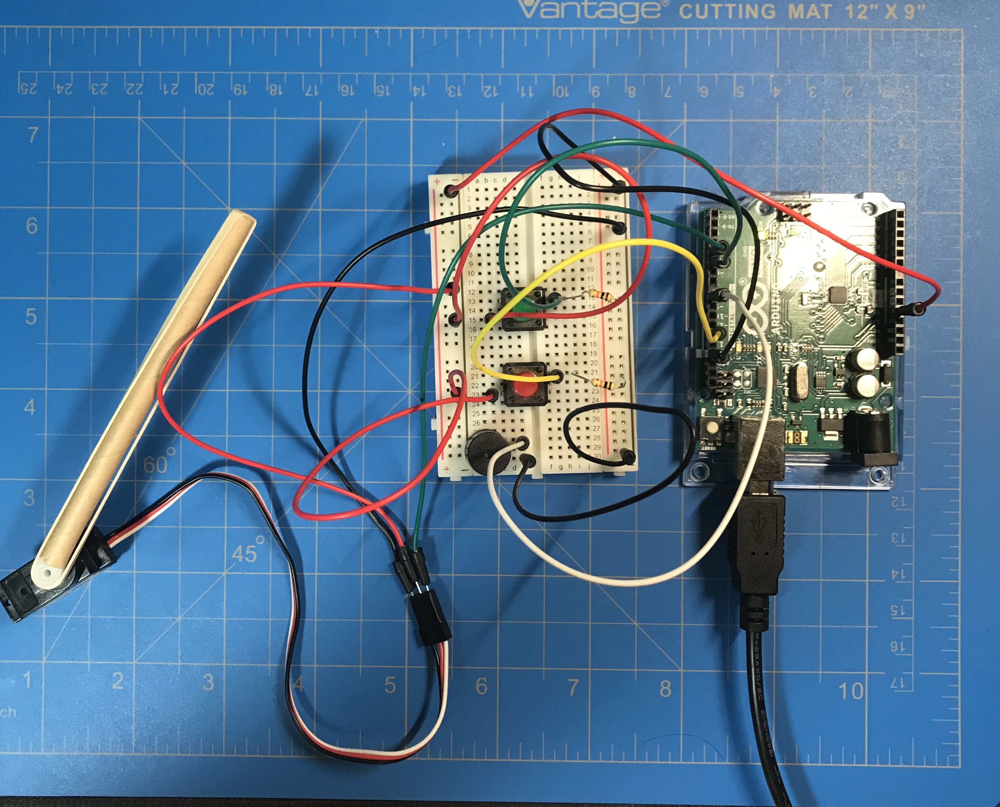
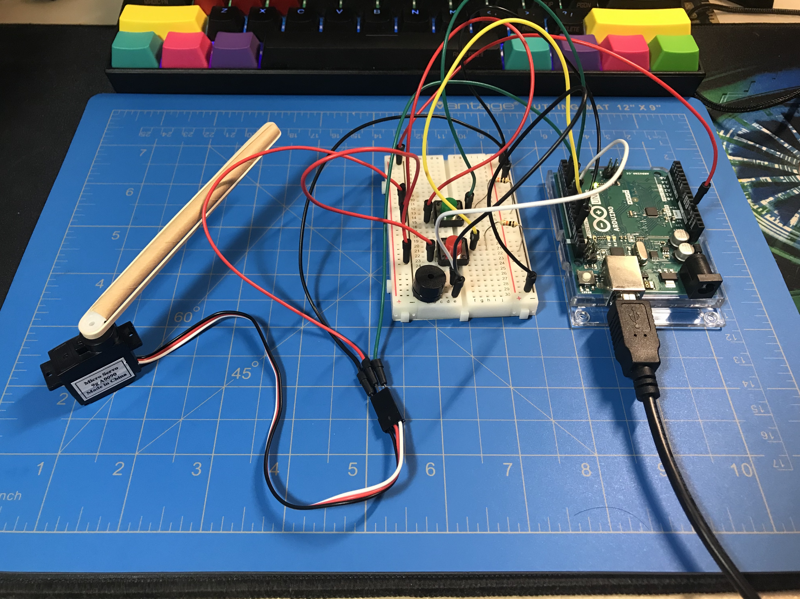
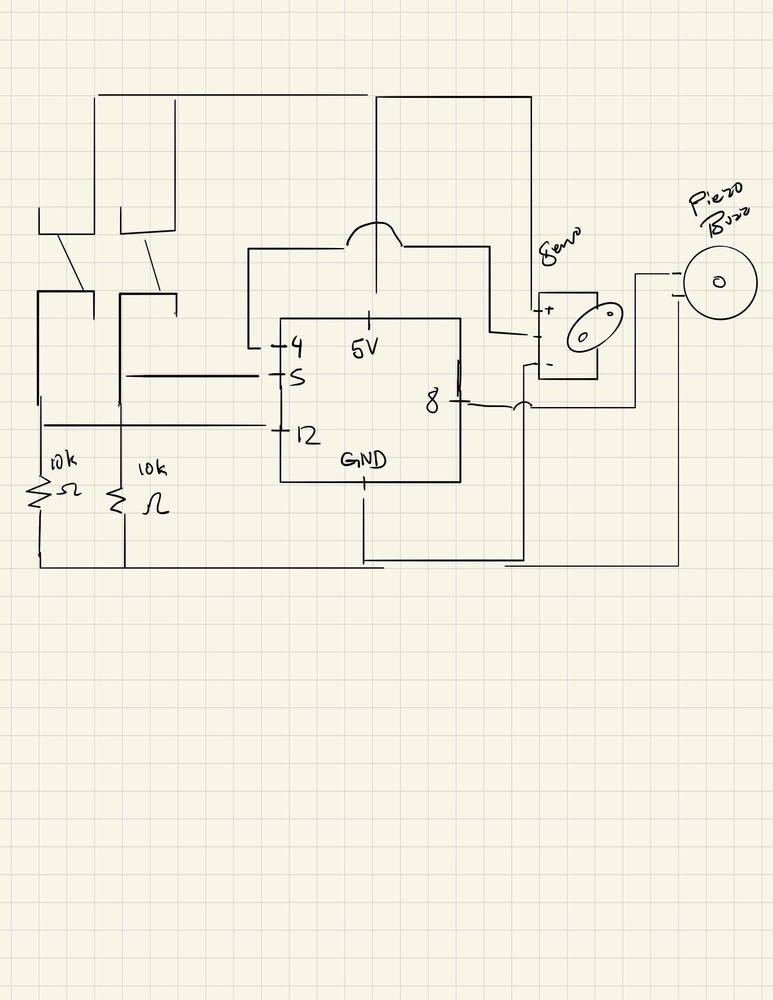

# Music Instrument

The music instrument is meant to be a metrenome that hits against objects in conjunction with the song of Canon in D. 

The main components of the instrument consists of the red switch, green switch, piezo buzzer, and servo motor. When the red switch is pressed, Canon in D begins to play through the piezo buzzer. When the green switch is pressed, the arm moves to a specified degree and when the switch is released the arm moves to another degree. The arm acts as a metrenome that can be used to hit surfaces to create sound. 

The stick attatchment to the servo that acts as the arm of the metrenome was quite tricky to attach. 

Problems I am still facing is getting the servo to move along with the song playing at the same time. So for now, it is two seperate entities: a music player and a metrenome.

Here are pictures of my instrument!

[Here is an embedded Youtube link of my instrument in action!](https://youtu.be/40VWmy5pk6M)

Here is a picture of my schematic!

