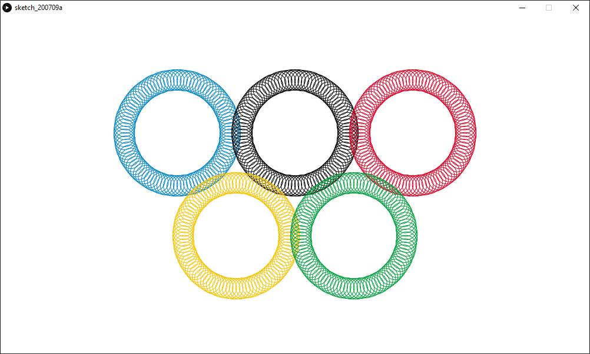

# Loops + Transformations

Here is a picture of the Olympic Rings (:

The inspiration for the drawing was the [Olympic rings](https://www.google.com/search?q=olympic+rings&rlz=1C1CHBF_enUS797US797&sxsrf=ALeKk00-WsXyeB8hNUAhAB-HdIPqCztndg:1594601350569&source=lnms&tbm=isch&sa=X&ved=2ahUKEwjW2bv4gMnqAhWTFzQIHabtDSoQ_AUoAXoECBYQAw&biw=1920&bih=937). I've always enjoyed watching the Olympics and was especially hyped for this year's Tokyo 2020 Summer Olympics because sport climbing was a new event that would be debutted in this year's Games. [Olympic Ring's Hex & RGB codes](https://www.schemecolor.com/olympic-logos-and-symbols-colors.php#:~:text=The%20Olympic%20Logos%20And%20Symbols,created%20by%20user%20Keshav%20Naidu).

I have mainly one "color"() function that are copy and pasted five times to represent the five rings; The difference amongst them are the different translate(x,y) values and stroke(). The function starts off with pushMatrix() to push the translate() into the matrix stack. Then, the for loop forms a circle using circles. Finally, popMatrix() is called to reset the matrix stack for the next "color"() function. Also, on the very top is the setup() function that sets up the display window and calls upon the five ring functions. 

The main difficulty I faced was understanding how to "reset" the translation. It was a problem when I was programming my second ring because it was translating based on the origin from the first ring; After some Googling the pushMatrix() and popMatrix() functions could be used to reset the origin back to (0, 0).

Something I found interesting was that hex color codes could be used when assigning colors. Also, learning the power of the pushMatrix() and popMatrix() functions was really interesting.
