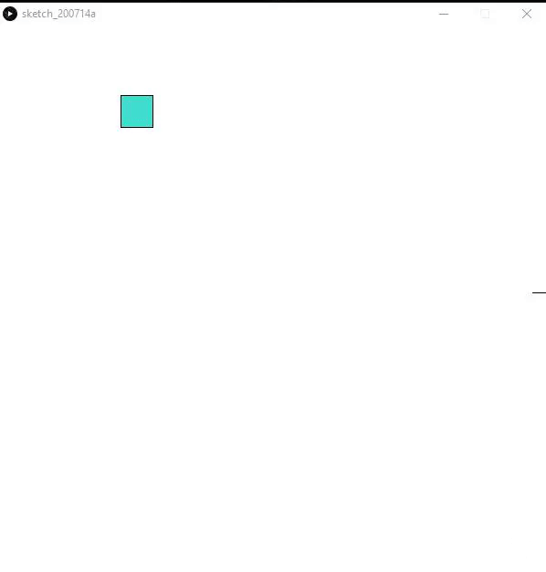

# Game

Here is a GIF of my barebones Aim Trainer!

My inspiration for the making this is because I've been trying to pick up FPS games and Aim Trainer's can help with improving my gameplay.

The most difficult part of this was learning how to utilize the [mousePressed() function](https://processing.org/reference/mousePressed_.html). And making sure the square only switches if the mouse actually presses within the square. 
