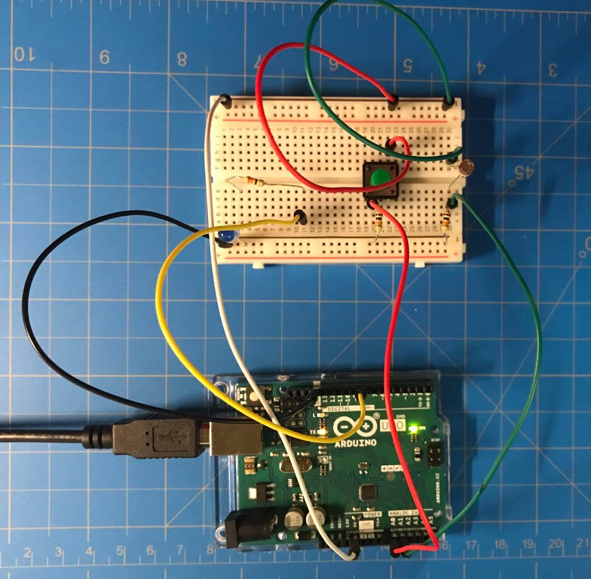

# Photoresistor + Switch LED Controller

Here is a picture of my Project!

There are two main components to this: The Switch & The Photoresistor.

When the switch is pressed the LED light on the breadboard turns off and stays on for a second after it is not pressed. After the second is over the LED light on the ARDUINO turns on and turns off after a second when the LED light on the breadboard turns on.

When the photoresistor senses light above 900, which is the strength of the flash light on my iPhone, the LED light on the bread board flashes. 

I didn't really stumble upon any major problems, I just went through the BASIC EXAMPLES and played around with the setups. Also, rewatched lecture. 

Now here is a picture of my Schematic!
