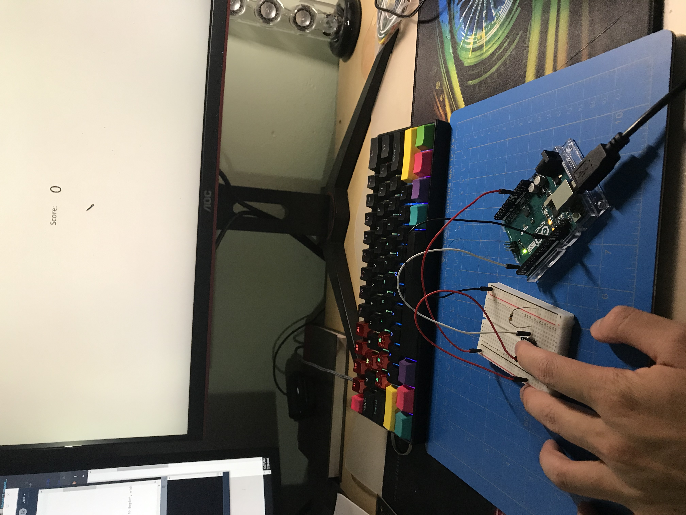
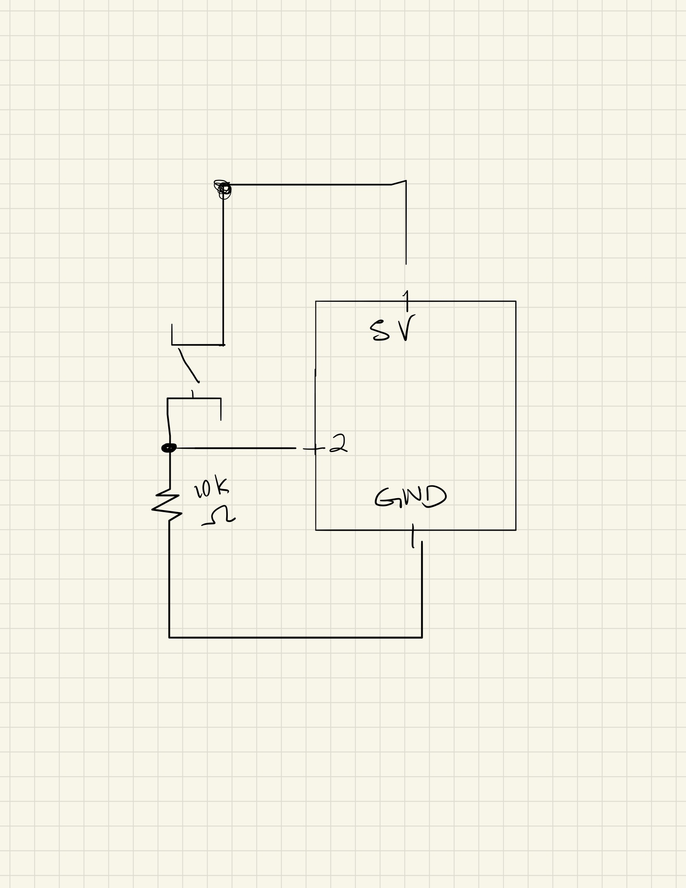

# Game + Arduino

Here is a picture of my Square Clicking Game played with an Arduino switch rather than mouse!

For this version of my midterm game, I added the functionality of being able to play the game with the Arduino switch instead of mouse clicking. It is a much "laggier" experience, but it was cool that it works.

The most challenging part was getting the game to work properly. 

Here is a picture of the schematic, just a simple switch!

