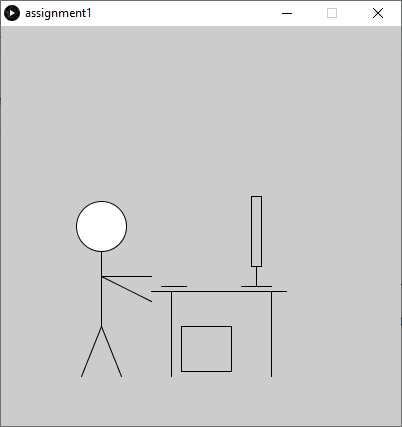

# Portrait + Environment

Here is a picture of me and my pc (:

This is me in front of my monitor, hands near my keyboard, and my PC near my feet on the floor. This environment is important to me because it is where I study & work on school work, socialize with friends on Discord, play video games, and browse the web.

I struggled with understanding the [coordinate system of Processing](https://processing.org/tutorials/drawing/). It's a bit different from the typical x-y coordinates from math classes. I found it interesting that once I figured out the coordinate system I was able to quickly draw my lines and finish up my artwork.
