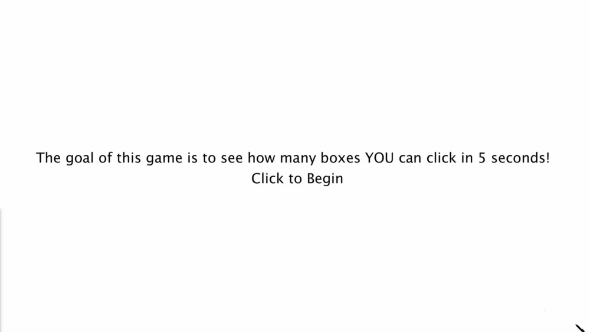

# Game

Here is a GIF of my Square Clicking Game!

This is an improvement from my previous "Aim Trainer Concept". I added 3 different game states, which composed of the Home Screen, Game Screen, End Screen. In the Home Screen the goal of the game is explained, with a click of the mouse the player moves to the Game Screen and clicks squares for 10 seconds, and finally they reach the End Screen that displays the score they received. If the player presses their keyboard the game returns to the Home Screen state. 

ENJOY!!!
