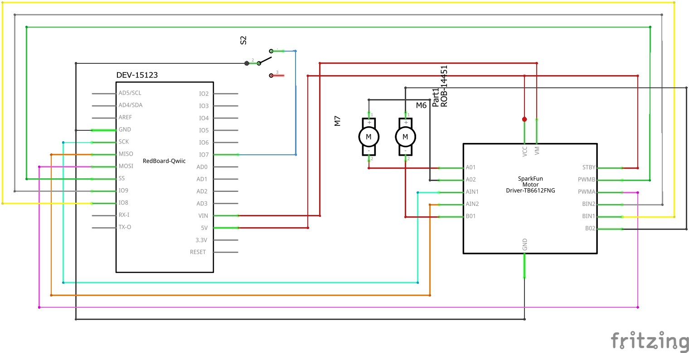

# desinv23 final project

Here are pictures of the physical aspects of the project!

The goal of this project was to focus on creating a full interactive experience using Arduino and Processing. The basic premise is using Arduino to power a vehicle and the OpenCV library on Processing to image processing on a user's face with a webcam. Both are controlled using the WASD keys on a keyboard. Each key press will move the vehicle in a certain direction and also trigger an image change to whatever the webcam picks up. 

Below is the Schematic of the vehicle!

